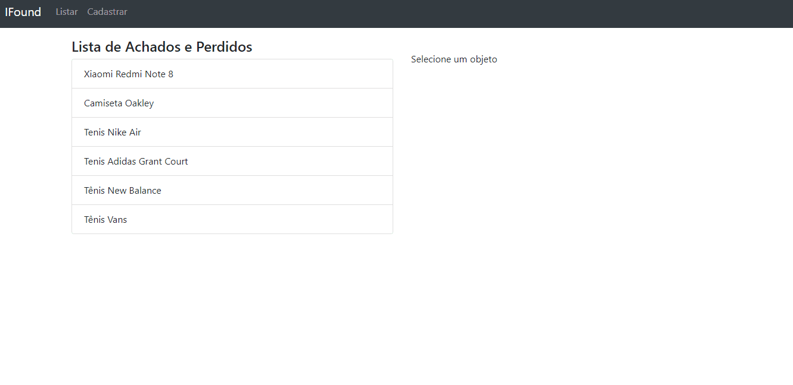
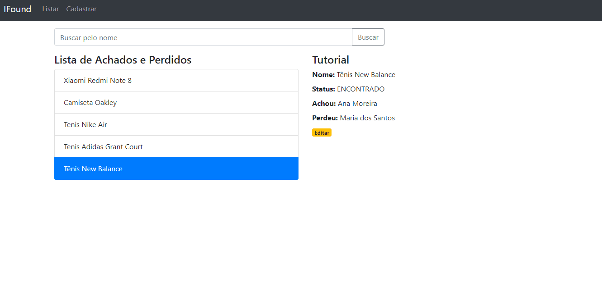

<h1 align="center">IFound</h1>

🚀 API REST densenvolvida em .NET Core!

## Sobre
O projeto IFound trata-se de uma API REST para prover dados a um site de achados e perdidos

## Tabela de conteúdos
<!--ts-->
   * [Sobre](#sobre)
   * [Tabela de Conteúdos](#tabela-de-conteúdos)
   * [Features](#features)
   * [Tecnologias](#-tecnologias)
   * [Pré-requisitos](#pré-requisitos)
   * [Rodando a aplicação](#rodando-a-aplicação)  
   * [Testes](#testes)
<!--te-->

### Features

- [x] Cadastro de um “Achado”/”Perdido”
- [x] Atualização de histórico de um “Achado”/”Perdido”
- [x] Busca com opção de filtros
- [x] Relatório de cruzamento de informações “Achados”/”Perdidos”, dado um categoria e um raio

### 🛠 Tecnologias
Para a construção deste projeto, foram utilizadas as seguintes ferramentas:
#### No Back-End:
- [.NET Core](https://dotnet.microsoft.com/)
- [Entity Framework Core](https://docs.microsoft.com/pt-br/ef/core/)
- [SQL Server](https://www.microsoft.com/en-us/sql-server)
- [XUnit](https://xunit.net/)
- [OData](https://www.odata.org/)

#### No Front-End
- [Angular](https://angular.io/)
- [Jasmine](https://jasmine.github.io/)

### Pré-requisitos
Antes de começar, você precisará ter instalado em sua máquina as seguintes ferramentas:
* Git (https://git-scm.com/book/en/v2/Getting-Started-Installing-Git)
* SDK Do ASP.NET Core Versão 3.1 (https://dotnet.microsoft.com/download/dotnet-core/3.1)
* SQL Server LocalDB (https://docs.microsoft.com/pt-br/sql/database-engine/configure-windows/sql-server-express-localdb?view=sql-server-ver15) ou seu banco de dados de preferência
* NPM (https://www.npmjs.com/get-npm)
* CLI do Angular (https://cli.angular.io/)

### Rodando a aplicação
#### API IFound
Para instalar e rodar o projeto em sua máquina, siga os seguintes passos;
* Rode o comando "git clone 'url-do-repositorio'" na sua máquina local
* Para facilitar a criação das estruturas no banco, criei um script para o SQL Server (SetUpDB.sql), basta executá-lo
* Mude a string de conexão com o banco no arquivo 'appsettings.json' com os seus dados de conexão
* Mudar a string de conexão em 'appsettings.json' com os dados do seu banco
* Dentro da pasta "ifound-api", rode o projeto via comando "dotnet run ifound-api.csproj"

#### Aplicação front-end
* Na pasta 'front-end-ifound' instale os pacotes via 'npm install'
* Execute a aplicação via comando 'ng serve'

### Testes
As demonstrações dos testes foram todas feitas via ferramenta Postman (https://www.postman.com/). Neste artigo, foi feita uma simples demonstração de funcionalidade para cada feature existente no backlog do projeto.

#### Feature: Cadastro de um “Achado”/”Perdido”
Para esta feature, foi feita uma demonstração com o cadastro de um produto por meio do endpoint "AddObject". A este endpoint foram passadas as informações do objeto, assim como sua categoria e dados das pessoas que perderam o objeto ou o encontraram. Desse modo, o objeto foi registrado com o id de categoria igual a 3 (por ser da categproa sapato) e foram assosiados a ele os ids 2 e 3 das pessoas que o perderam e o encontraram respectivamente.

#### Feature: Atualização de histórico de um “Achado”/”Perdido”
Pada demonstrar esta feature, foi utilizado o endpoint "UpdateObject". Neste sentido, foram passados os dados do objeto a que se tem a intenção de atualizar. Para isso, foi escolhido o objeto de id igual a 5 (Smartphone Xiaomi Note 8). Foram atualizados os campos de descrição do objeto e o local em que foi perdido. A seguir, pode-se ver que os dados foram persisitidos ao se fazer uma consulta de todos os objetos via endpoint "GelAllObjects".

#### Feature: Busca com opção de filtros
Na demonstração desta feature foi utilizado o endpoint "GetAllObjects" para se validar a funcionalidade dos filtros. Estes foram implementados via pacote OData da Microsoft, que permite consultas personalizadas aos endpoints da API. Para demonstrar a eficiência dos filtros, primeiro fez-e uma consulta de todos osobjetos do endpoint. Logo após isso, fez-se uma consulta de todos os objetos que possuiam a propriedade "ObjectId" da entidade "Object" com valor igual a 5. Para isso, foi incorpordado à URL da requisição os seguintes parâmetros:

* _"$Filter=Object/ObjectId eq 5"_

A seguir, fez-se uma consulta de todos os objetos que possuiam a propriedade "CategoryId" da entidade "ObjectCategory" com valor igual a 1 (categoria de roupas), mudando os parâmetros como o axemplo:

* _?$Filter=ObjectCategory/CategoryId eq 1_

#### Feature: Relatório de cruzamento de informações “Achados”/”Perdidos”, dado uma categoria e um raio
Por fim, para se demonstrar a última feature do backlog, foi feita uma consulta com o seguinte filtro:

* _?$Filter=ObjectCategory/CategoryId eq 3 and Object/ObjectLostLocation eq 'São José do Rio Preto / SP'_

Com isso, temos um relatório dos objetos com base em sua categoria e localização. Na demonstração, pode-se observar que foram encontrados dois produtos (Tênis da Nike e Tênis da Adidas), ambos com id de categoria igual a 3 (sapatos) e tambeém ambos com localização de onde foram perdidos igual a 'São José do Rio Preto / SP'

#### Demonstrações no Front-End
Para dar mais realismo ao projeto, foi desenvolvida uma aplicação front-end simples em Angular 10 que ilustra algumas de suas features.
Primeiramente, pode-se ver na demosntração a seguir, como é feita a listagem dos objetos pela aplicação. Ao clicar sobre determinado objeto, são exibidas as suas informações.

Em seguida, clicando no botão de editar, é possivel por meio da tela de detalhe do item, poder editar qualquer uma de suas informações. Na demonstração, assim que o item é editado e não ocorre nenhuma exceção é possível ver a modificação já na tela de listagem.

Por fim, para ilustrar a operação de cadastro de um achado ou perdido, na demonstração a seguir é cadastrado um objeto via tela tela de cadastro e em seguida, a nova inserção pode ser visualizada na tela de listagem de itens.

