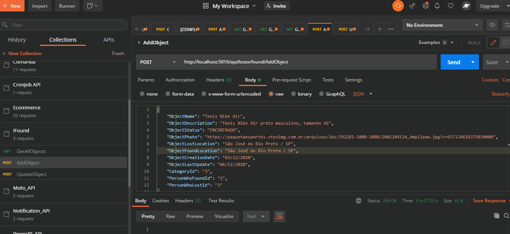
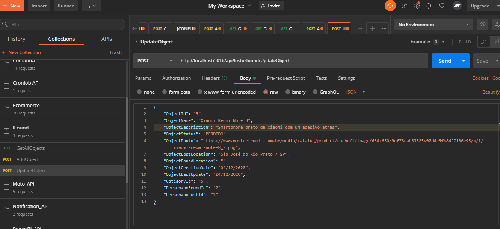
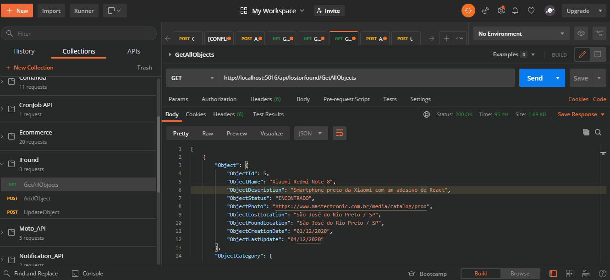
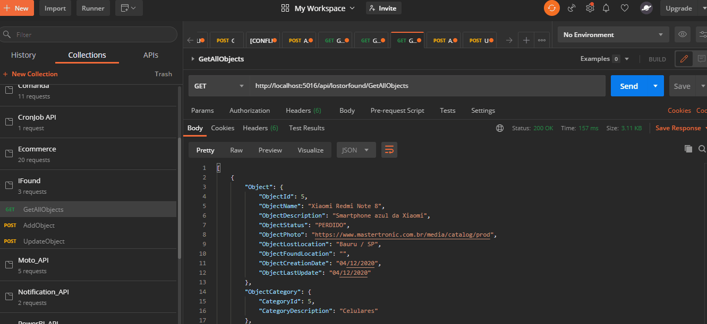

<h1 align="center">IFound</h1>

🚀 API REST para prover dados a um site de achados e perdidos

## Sobre
O projeto IFound trata-se de uma API REST para um site de achados e perdidos

## Tabela de conteúdos
<!--ts-->
   * [Sobre](#Sobre)
   * [Tabela de Conteudo](#tabela-de-conteudo)
   * [Features](#features)
   * [Tecnologias](#tecnologias)
   * [Pré-Requisitos](#pre-requisitos)
   * [Rodadando a aplicação](#instalacao)  
   * [Testes](#testes)
<!--te-->

### Features

- [x] Cadastro de um “Achado”/”Perdido”
- [x] Atualização de histórico de um “Achado”/”Perdido”
- [x] Busca com opção de filtros
- [x] Relatório de cruzamento de informações “Achados”/”Perdidos”, dado um categoria e um raio

### 🛠 Tecnologias

Para a construção deste projeto, foram utilizadas as seguintes ferramentas:

- [.NET Core](https://dotnet.microsoft.com/)
- [Entity Framework Core](https://docs.microsoft.com/pt-br/ef/core/)
- [SQL Server](https://www.microsoft.com/en-us/sql-server)
- [XUnit](https://xunit.net/)
- [OData](https://www.odata.org/)

### Pré-requisitos
Antes de começar, você precisará ter instaladas em sua máquina as seguintes ferramentas:
* Git (https://git-scm.com/book/en/v2/Getting-Started-Installing-Git)
* SDK Do ASP.NET Core Versão 3.1 (https://dotnet.microsoft.com/download/dotnet-core/3.1)
* SQL Server LocalDB (https://docs.microsoft.com/pt-br/sql/database-engine/configure-windows/sql-server-express-localdb?view=sql-server-ver15) ou seu banco de dados de preferência

### Rodando a aplicação
Para instalar e rodar o projeto em sua máquina, siga os seguintes passos;
* Rode o comando "git clone 'url-do-repositorio'" na sua máquina local
* Para facilitar a criação das estruturas no banco, criei um script para o SQL Server (SetUpDB.sql), basta executá-lo
* Mude a string de conexão com o banco no arquivo 'appsettings.json' com os seus dados de conexão
* Mudar a string de conexão em 'appsettings.json' com os dados do seu banco
* Dentro da pasta "ifound-api", rode o projeto via comando "dotnet run ifound-api.csproj"

### Testes
As demonstrações dos testes foram todas feitas via ferramenta Postman. Para tal segue cada uma delas para cada feature presente no backlog do projeto:

#### Feature: Cadastro de um “Achado”/”Perdido”
Nesta demonstração, foi cadastrado um produto por meio do endpoint "AddObject". A este endpoint foram passadas as informações do objeto, assim como sua categoria e dados das pessoas que perderam o objeto ou o encontraram (se existirem). Desse modo, o objeto foi registrado com o id de categoria igual a 3 (por ser da categproa sapato) e foram assosiados a ele os ids de pessoas que perderam e o encontraram 2 e 3 respectivamente.

#### Feature: Atualização de histórico de um “Achado”/”Perdido”
Para esta demonstração, foi utilizado o endpoint "UpdateObject". Neste sentido, foram passados os dado do objeto a que se tem a intenção de atualizar, teste caso, o objeto de id igual a 5 (smartphone Xiaomi Note 8). Foram atualizados os camps de descrição do objeto e Local em que foi perdido. A seguir, pode-se ver que os dados foram persisitidos ao se fazer uma consulta de todos os objetos via endpoint "GelAllObjects"

#### Feature: Busca com opção de filtros
Aqui, foi utilizado o endpoint "GetAllObjects" para a demonstração dos filtros. Estes foram implementados via pacote OData da Microsoft, que permite consultas personalizadas aos endpoints da API. Para demonstrar a eficiência dos filtros, primeiro fez-e uma consulta de todos osobjetos do endpoint. Logo após isso, fez-se ma consulta de todos os objetos que possuiam a propriedade "ObjectId" da entidade "Object" com valor igual a 5 adicionando-se para esta finalidade, a seguinte descrição à requisição:
"$Filter=Object/ObjectId eq 5"
A seguir, fez-se uma consulta dde todos os objetos que possuiam a propriedade "CategoryId" da entidade "ObjectCategory" com valor igual a 1 (categoria de roupas). Para isso, foi adicionada a seguinte descrição à requisição:
?$Filter=ObjectCategory/CategoryId eq 1

#### Feature: Relatório de cruzamento de informações “Achados”/”Perdidos”, dado um categoria e um raio
Neste caso para se fazer um relatório com base na categoria e na localização dos objetos, foi feita uma consulta com o seguinte filtro:
?$Filter=ObjectCategory/CategoryId eq 3 and Object/ObjectLostLocation eq 'São José do Rio Preto / SP'
Na demonstração, pode-se observar que foram encontrados dois produtos (tênis da Nike e Tênis da Adidas), ambos com id de categoria igual a 3 (sapatos) e tambeém ambos com localização de onde foram perdidos igual a 'São José do Rio Preto / SP'

